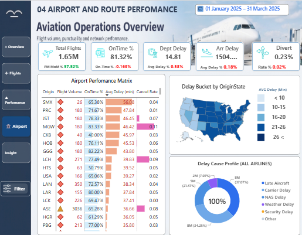

<div align="center">


<br>


<br><br>

<a href="mailto:sarthak.sharma20041705@gmail.com">

</a>
&nbsp;
<a href="https://github.com/sarthak-2233">

</a>

<br><br>


</div>

---

# `01` // SYSTEM.IDENTITY

<div align="center">

```text
┌──────────────────────────────────────────────────────────────┐
│                                                              │
│                    SARTHAK@DEVELOPER                         │
│                                                              │
│  ROLE        →  FULL STACK DEVELOPER                         │
│  SPECIALTY   →  AI + DATA + WEB                              │
│  STATUS      →  BUILDING                                     │
│  LOCATION    →  INDIA                                        │
│  CURRENT     →  CODELOOM 🧠                                  │
│                                                              │
└──────────────────────────────────────────────────────────────┘
```

</div>

I'm a **final-year engineering student** passionate about building scalable applications, intelligent systems, and data-driven products.

I enjoy working at the intersection of:

**💻 Software Engineering + 🤖 Artificial Intelligence + 📊 Data**

My goal isn't just to write code.

> **I want to turn ideas into products that solve real problems.**

---

# `02` // DEVELOPER.MODE

```javascript
const sarthak = {

    identity: "Developer & Builder",

    roles: [
        "Full Stack Developer",
        "Data Analyst",
        "AI Enthusiast"
    ],

    currentlyBuilding: "CodeLoom",

    interests: [
        "Scalable Backend Systems",
        "Artificial Intelligence",
        "Data Analytics",
        "Semantic Search",
        "Vector Databases",
        "Developer Tools"
    ],

    philosophy:
        "Build → Break → Learn → Improve → Repeat"
};
```

---

# `03` // FEATURED.PROJECTS

<br>

## ✈️ Aviation Analytics

### `DATA × ANALYTICS × VISUALIZATION`

> **Turning aviation data into meaningful insights.**

A data analytics project focused on exploring aviation datasets, identifying patterns, analyzing flight and airline performance, and presenting insights through interactive dashboards.

### 🔍 What I Explored

```text
✈️ Flight Analysis
🛫 Airport Performance
🏢 Airline Performance
⏱️ Delay Analysis
📊 KPI Analysis
📈 Data Visualization
```

### 🛠️ Technology

`Python` `Pandas` `SQL` `Power BI` `Excel` `Data Visualization`

<br>

### 📊 Dashboard Preview

<!--
===============================================================
UPLOAD YOUR IMAGE TO:

assets/aviation-dashboard.png

THEN THIS IMAGE WILL APPEAR HERE.
===============================================================
-->

<div align="center">



</div>

<br>

<div align="center">

**📂 Repository** &nbsp;&nbsp; `|` &nbsp;&nbsp; **📊 Dashboard**

</div>

---

<br>

# 🧠 CodeLoom

### `AI × FULL STACK × DEVELOPER TOOLS`

> **An AI-powered coding platform I'm currently building.**

CodeLoom is my flagship project focused on creating a smarter development environment through AI-powered assistance, semantic search, vector databases, and intelligent developer workflows.

### ⚡ Core Concepts

```text
🤖 AI Coding Assistance
🔎 Semantic Search
🧠 Vector Databases
💬 Intelligent Developer Interaction
⚡ AI-powered Workflows
🏗️ Scalable Backend Architecture
```

### 🛠️ Technology

`React` `Node.js` `Express` `MongoDB` `Redis` `Python` `AI` `Vector Search`

---

### 🖥️ CodeLoom Preview

<!--
===============================================================
MAIN CODELOOM SCREENSHOT:

assets/codeloom-dashboard.png
===============================================================
-->

<div align="center">


<br><br>

<!--
===============================================================
OPTIONAL SECOND CODELOOM SCREENSHOT:

assets/codeloom-ai.png
===============================================================
-->


</div>

<br>

<div align="center">

**📂 Repository** &nbsp;&nbsp; `|` &nbsp;&nbsp; **🚀 Live Demo**

</div>

---

# `04` // TECH.STACK

<div align="center">

### 💻 LANGUAGES


<br><br>

### 🎨 FRONTEND


<br><br>

### ⚙️ BACKEND


<br><br>

### 🗄️ DATABASES


<br><br>

### 🤖 AI / DATA


<br><br>


<br><br>

### ☁️ CLOUD / DEVOPS


<br><br>

### 🔧 TOOLS


</div>

---

# `05` // WHAT.I.BUILD

<table>
<tr>

<td width="50%" align="center">

### 💻 FULL STACK

Modern web applications, REST APIs, authentication systems and scalable backend architectures.

</td>

<td width="50%" align="center">

### 🤖 AI APPLICATIONS

Practical AI integrations designed to make software smarter and workflows more efficient.

</td>

</tr>

<tr>

<td width="50%" align="center">

### 📊 DATA PRODUCTS

Dashboards, analytics systems and visualizations that turn raw data into useful insights.

</td>

<td width="50%" align="center">

### 🧠 INTELLIGENT SYSTEMS

Semantic search, vector databases, OCR, computer vision and AI-powered workflows.

</td>

</tr>
</table>

---

# `06` // DATA × DEVELOPMENT

```text
                         RAW DATA
                            │
                            ▼
                     ┌─────────────┐
                     │   PROCESS   │
                     └──────┬──────┘
                            │
                            ▼
                     ┌─────────────┐
                     │   ANALYZE   │
                     └──────┬──────┘
                            │
                            ▼
                     ┌─────────────┐
                     │  VISUALIZE  │
                     └──────┬──────┘
                            │
                            ▼
                     ┌─────────────┐
                     │   INSIGHT   │
                     └──────┬──────┘
                            │
                            ▼
                    INTELLIGENT DECISION
```

### 📈 Data Toolkit

`Pandas` · `NumPy` · `Matplotlib` · `Plotly` · `Power BI` · `Excel`

> 📌 **Fun fact:** I enjoy analyzing stock market trends through data visualization.

---

# `07` // CURRENTLY.EXPLORING

```text
┌─────────────────────────────────────────────────────────────┐
│                                                             │
│  🧠 AI APPLICATIONS              ████████████████░░  80%    │
│  ⚙️ BACKEND ARCHITECTURE         ██████████████░░░░  70%    │
│  🔎 SEMANTIC SEARCH              █████████████░░░░░  65%    │
│  🗄️ VECTOR DATABASES             ████████████░░░░░  60%    │
│  ☁️ SCALABLE SYSTEMS             ███████████░░░░░░  55%    │
│                                                             │
└─────────────────────────────────────────────────────────────┘
```

---

# `08` // GITHUB.ANALYTICS

<div align="center">


<br><br>


<br><br>


</div>

---

# `09` // TROPHIES

<div align="center">


</div>

---

# `10` // CONTRIBUTION.ACTIVITY

<div align="center">


</div>

---

# `11` // 2026.MISSION

```text
                         2026
                           │
             ┌─────────────┼─────────────┐
             │             │             │
             ▼             ▼             ▼
           BUILD         LEARN          SHIP
             │             │             │
             ▼             ▼             ▼
          CodeLoom     AI Systems     Production
             │         Architecture     Projects
             │             │             │
             └─────────────┼─────────────┘
                           │
                           ▼
                    OPEN SOURCE 🚀
                           │
                           ▼
                    IMPACTFUL PRODUCTS
```

### 🎯 Goals

- [x] Full Stack Development
- [x] Data Analytics
- [x] AI Application Development
- [x] Vector Database Exploration
- [ ] 🚀 Take CodeLoom toward production
- [ ] 🤖 Build more AI-powered products
- [ ] 🌍 Contribute to open source
- [ ] 🤝 Collaborate on impactful projects
- [ ] 📚 Keep learning
- [ ] ⚡ Keep shipping

---

# `12` // BEYOND.CODE

<div align="center">

```text
☕  COFFEE        →  DEBUGGING FUEL

🎧  MUSIC         →  DEEP WORK MODE

📊  STOCK MARKET  →  DATA PLAYGROUND

🧠  AI            →  CURRENT OBSESSION

🚀  STARTUPS      →  FUTURE PLAYGROUND

💻  CODING        →  EVERYDAY ADVENTURE
```

</div>

---

# `13` // LET'S.CONNECT

<div align="center">

### Building something interesting?

### Let's build it together.

<br>

**AI Projects** · **Full Stack** · **Data** · **Open Source** · **Startups**

<br><br>

<a href="mailto:sarthak.sharma20041705@gmail.com">

</a>

<br><br>

<a href="https://github.com/sarthak-2233">

</a>

<br><br>

### `Build. Break. Learn. Repeat. 🚀`

<br>


</div>
